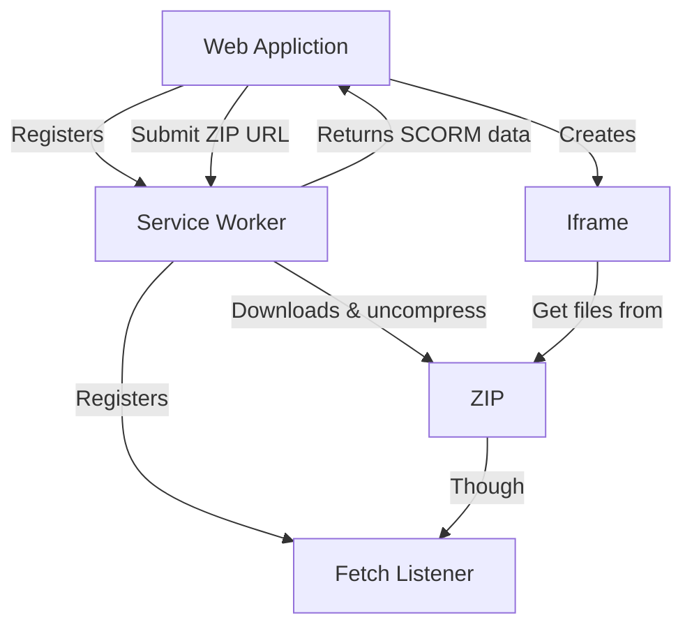

# SCORM-Serverless Proof Of Concept

Proof Of Concept proves SCORM packages can be rendered without the need for a monolith server side rendering LMS.

## What is does

1. Registers simple Service Worker
2. This app send to Service Worker ZIP url to download
3. Service Worker Downloads the ZIP, uncompress the content and analise the imsmanifest.xml file
4. Service Worker returns to host information about SCORM version and entrypoint
5. Service Worker registers a `fetch` register which returns files from ZIP

```js
self.addEventListener("fetch", async (e) => {
  /* return file from ZIP */
});
```

6. The app creates a `iframe` with prefix from Service Worker
7. All SCORM package files are served from ZIP with Service Worker



## Demo

[https://qunabu.github.io/SCORM-Serverless/](https://qunabu.github.io/SCORM-Serverless/)
